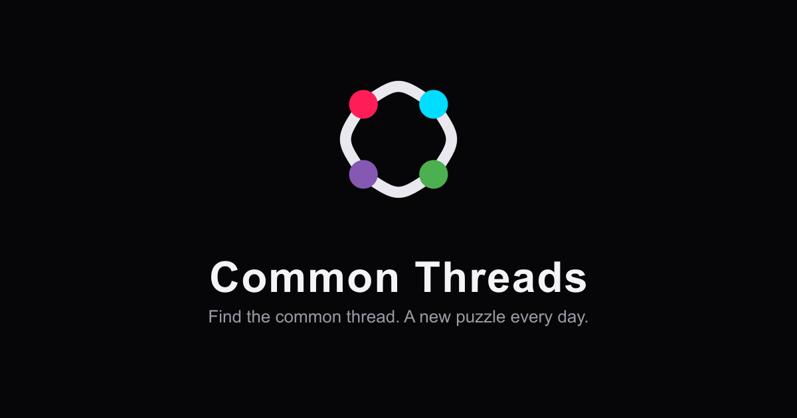

# Common Threads



Next.js implementation of [connections-api](https://github.com/davidbowland/connections-api) and connections-infrastructure. Find the common thread — a new puzzle every day. Example: <https://connections.dbowland.com/>

## Static Site

### Prerequisites

1. [Node](https://nodejs.org/en/)
1. [NPM](https://www.npmjs.com/)

### Local Development

The Next.js development server automatically rerenders in the browser when the source code changes. Start the local development server with:

```bash
npm run start
```

Alternatively, run a production build and serve that static content with:

```bash
npm run serve
```

Then view the server at <http://localhost:3000/>

### Unit Tests

[Jest](https://jestjs.io/) tests are run automatically on commit and push. If the test coverage threshold is not met, the push will fail. See `jest.config.ts` for coverage threshold.

Manually run tests with:

```bash
npm run test
```

### Prettier / Linter

Both [Prettier](https://prettier.io/) and [ESLint](https://eslint.org/) are executed on commit. Manually prettify and lint code with:

```bash
npm run lint
```

### Type Checking

Manually check TypeScript types with:

```bash
npm run typecheck
```

### Brand Assets

The favicons, `public/icon.svg`, and `public/og-image.png` are all generated from a single source of truth in `scripts/generate-favicons.js`. Regenerate them after changing the brand mark or colors with:

```bash
npm run generate:favicons
```

### Deploying to Production

This project automatically deploys to production when a merge to `master` is made via a pull request.

## Deploy Script

In extreme cases, the UI can be deployed with:

```bash
npm run deploy
```

The `developer` role and [AWS SAM CLI](https://aws.amazon.com/serverless/sam/) are required to deploy this project.

### Testing the Workflow

Use [act](https://github.com/nektos/act) to test the GitHub workflow. Install it with:

```bash
brew install act
```

When running locally, the workflow needs some secret values specified. Provide them with the `-s` flag (or a `--secret-file`), for example:

```bash
act -s AWS_ACCOUNT_ID=<value> -s AWS_ACCESS_KEY_ID=<value> -s AWS_SECRET_ACCESS_KEY=<value>
```

## Additional Documentation

### Additional Next.js Documentation

- [Documentation](https://nextjs.org/docs)

- [Learn Next.js](https://nextjs.org/learn)

- [API Reference](https://nextjs.org/docs/app/api-reference)

### Additional Deploy Documentation

- [AWS SAM CLI](https://docs.aws.amazon.com/serverless-application-model/latest/developerguide/serverless-sam-cli.html)

- [AWS CLI S3 sync](https://docs.aws.amazon.com/cli/latest/reference/s3/sync.html)

### Additional Workflow Documentation

- [Workflow Syntax for GitHub Actions](https://docs.github.com/en/actions/reference/workflow-syntax-for-github-actions)

- [actions/setup-node](https://github.com/actions/setup-node)

- [actions/checkout](https://github.com/actions/checkout)
